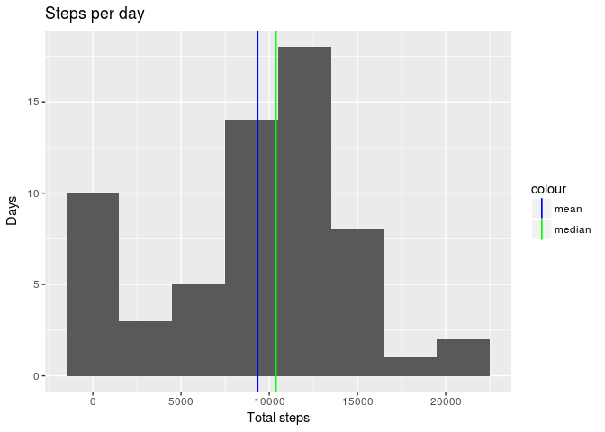
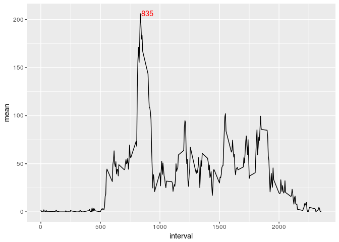
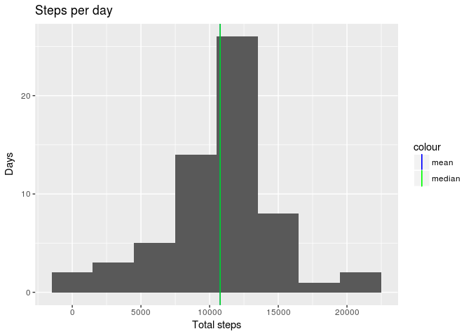
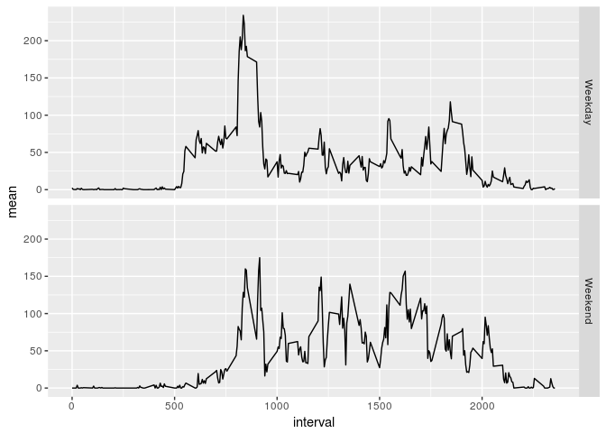

# Reproducible Research: Peer Assessment 1


# Overview

This document provides an analysis of the data supplied for a personal activity monitoring device, as detailed in the assignment for reproducible research at https://github.com/Garlando/RepData_PeerAssessment1

## 1. Loading and preprocessing the data

First lets read in and do some simple preprocessing of the dataset, most of its fine as is but later we'll need to use full timestamps so lets create a column "datetime" that combines "date" and "interval" into one timestamp object 


```r
library(dplyr)
```

```
## 
## Attaching package: 'dplyr'
```

```
## The following objects are masked from 'package:stats':
## 
##     filter, lag
```

```
## The following objects are masked from 'package:base':
## 
##     intersect, setdiff, setequal, union
```

```r
activity <- read.csv(unz('activity.zip', 'activity.csv'))

activity$interval2 <- sprintf('%04d', activity$interval)
activity$datetime <- as.POSIXct(strptime(paste(activity$date, activity$interval2), "%Y-%m-%d %H%M"))
activity <- select(activity, steps, date, datetime, interval)

summary(activity)
```

```
##      steps                date          datetime                  
##  Min.   :  0.00   2012-10-01:  288   Min.   :2012-10-01 00:00:00  
##  1st Qu.:  0.00   2012-10-02:  288   1st Qu.:2012-10-16 05:58:45  
##  Median :  0.00   2012-10-03:  288   Median :2012-10-31 11:57:30  
##  Mean   : 37.38   2012-10-04:  288   Mean   :2012-10-31 11:30:51  
##  3rd Qu.: 12.00   2012-10-05:  288   3rd Qu.:2012-11-15 17:56:15  
##  Max.   :806.00   2012-10-06:  288   Max.   :2012-11-30 23:55:00  
##  NA's   :2304     (Other)   :15840                                
##     interval     
##  Min.   :   0.0  
##  1st Qu.: 588.8  
##  Median :1177.5  
##  Mean   :1177.5  
##  3rd Qu.:1766.2  
##  Max.   :2355.0  
## 
```

## 2. What is mean total number of steps taken per day?

Next lets show how steps vary over days. First we'll total up the steps for each day, then plot them as a histogram. We can also add the mean & median steps per day


```r
library(ggplot2)


plotStepsPerDay <- function(dataset) {
  activityPerDay <- select(dataset, steps, date) %>% 
    group_by(date) %>%
    summarise(total = sum(steps,na.rm = TRUE), 
              mean = mean(steps, na.rm=TRUE),
              median = median(steps, na.rm=TRUE))
  
  stepsPlot <- ggplot(activityPerDay, aes(total)) +
    geom_histogram(binwidth = 3000) +
    geom_vline(aes(xintercept = mean(activityPerDay$total), colour='mean')) +
    geom_vline(aes(xintercept = median(activityPerDay$total), colour='median')) +
    scale_color_manual(values=c(mean='blue',median='green')) +
    labs(title = 'Steps per day', x = 'Total steps', y = 'Days')
  stepsPlot
}

plotStepsPerDay(activity)
```

<!-- -->

## 3. What is the average daily activity pattern?

Next we'll look at how activity varies across the day, the below plot shows average steps per interval, averaged across the interval for every day. at its peak we can see that the most active interval on average was 08:35am


```r
dailyActivity <- select(activity, steps, interval) %>% 
  group_by(interval) %>%
  summarise(mean = mean(steps,na.rm = TRUE))
maxPoint = dailyActivity[which.max(dailyActivity$mean), ]

dailyActivityPlot <- ggplot(dailyActivity, aes(x = interval, y = mean, group = 1)) +
  geom_line() +
  annotate("text", label = maxPoint$interval, x = maxPoint$interval + 60, y = maxPoint$mean, col = 'red')
dailyActivityPlot
```

<!-- -->

## 4. Imputing missing values

There are a large number of missing step values, as can be seen earlier in the summary of the dataset, infact there are entire days without any step information. To balance this out the below code takes the means calculated earlier for each interval and replaces the corresponding na's giving us a full dataset that we can use to replot the earlier histogram, notice how the frequency of days with 0 steps drops


```r
na_rows <- sum(is.na(activity$steps))
na_row_mask <- is.na(activity$steps)
just_na_activity <- activity[na_row_mask, ]
merged_na_activity <- merge(just_na_activity, dailyActivity[,],  by='interval')
merged_na_activity$steps <- merged_na_activity$mean
na_replacements <- select(merged_na_activity, steps,date,datetime,interval)
imputed_activity <- rbind(activity[!na_row_mask, ], na_replacements)

plotStepsPerDay(imputed_activity)
```

<!-- -->


## 5. Are there differences in activity patterns between weekdays and weekends?

Finally we'll see if there any difference ebtween activity on weekdays and weekends. The below code creates a similar plot to section 3, but divides activity by weekday/weekend. The most obvious point from this is a higher period of activity on weekdays in the early morning (08:00 - 09:00) and some slightly higher peaks throughout the day on weekends


```r
activity$weekday = weekdays(activity$datetime)
dayType <- (activity$weekday %in% c("Monday","Tuesday","Wednesday","Thursday","Friday"))
activity$dayType <- factor(ifelse(dayType, "Weekday",  "Weekend"))

dailyActivity <- select(activity, steps, interval, dayType) %>% 
  group_by(dayType, interval) %>%
  summarise(mean = mean(steps,na.rm = TRUE))

dailyActivityPlot <- ggplot(dailyActivity, aes(x = interval, y = mean, group = dayType)) +
  geom_line() +
  facet_grid(dayType ~ .)
dailyActivityPlot
```

<!-- -->


